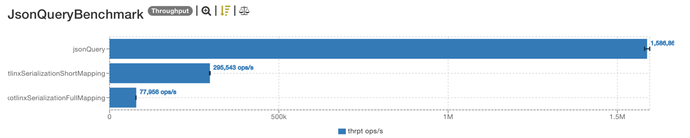

# Kotlin JSON Query 🚀

[](https://kotlinlang.org/)
[](LICENSE)
[](https://github.com/lexa-diky/json-query-kt/actions)


A lightweight Kotlin library for querying and transforming JSON data using a fluent, composable API. ✨

## Features 🛠️

- 🧭 Traverse nested paths, index and slice JSON arrays
- 🔎 Select and filter JSON object properties
- 📊 Aggregate data common functions
- 🧩 Compose queries fluently
- 📚 Naturally compatible with Kotlin Notebook

## Get Started 🚀

```kotlin
implementation("io.github.lexa-diky:json-query:<LATEST>")
```

## Quick Examples 🚦

### [Kotlin Notebook](./example/notebook.ipynb)

### Querying Json data

```kotlin
val json = Json.parseToJsonElement(File("dataset.json").readText())

// Accessing a nested property
println(json.query { path("shelter.name") })

// Accessing an array element by index
println(json.query { path("shelter.cats")[0].path("name") })
println(json.query { path("shelter.cats.0.name") })
println(json.query("shelter.cats.0.name"))

// Accessing all names in an array
println(json.query { path("shelter.cats.name") })

// Wildcard path
println(json.query { path("shelter.*.name") })

// Filtering array elements
println(json.query { path("shelter.cats.name").filterT<String> { it.startsWith("M") } })

// Slicing arrays
println(json.query { path("shelter.cats")[0..1].path("name") })
```

### Typed query results with `queryAs`

You can use `queryAs` to directly convert the result of a query to a Kotlin type (e.g., List, Map, Int, String):

```kotlin
// Get a list of cat names as List<String>
val names = json.queryAs<List<String>> { path("shelter.cats.name") }
// Get a single age as Int
val age = json.queryAs<Int> { path("shelter.cats.1.age") }
```

### Modifying queried data

```kotlin
// Statistical operations
println(json.query { path("shelter.cats.age").max() })
println(json.query { path("shelter.cats.age").min() })
println(json.query { path("shelter.cats.age").average() })
println(json.query { path("shelter.cats.age").sum() })
println(json.query { path("shelter.cats.age").first() })
println(json.query { path("shelter.cats.age").last() })
println(json.query { path("shelter.cats.age").filterT<Int> { it >= 2 }.size() })

// Selecting specific fields
println(json.query { path("shelter.cats.0").select("name", "age") })
println(json.query { path("shelter.cats").select("name", "age") })

// Aggregating data into objects
println(json.query {
    path("shelter.cats").qmap {
        buildJsonObject {
            put("names", query { path("name") })
            put("ages", query { path("age") })
        }
    }
})

// Applying a query to each element in an array
println(json.query {
    path("shelter.cats.name")
        .each { mapT<String, String> { it.uppercase() } }
})
```

## Performance

`json-query-kt` is designed to be efficient and fast, it beats standard kotlinx-serialization object mapping in most
cases, especially for large datasets and/or complex serialization logic.

